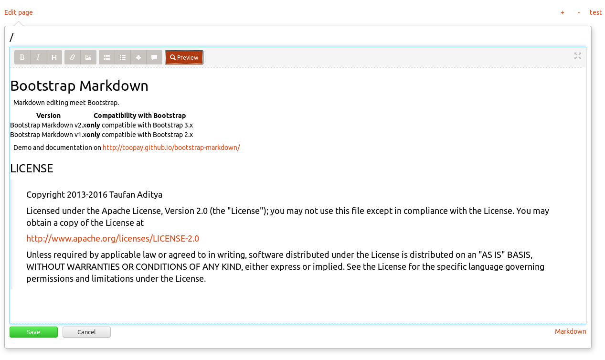

# YellowBootstrapMarkdown

[Bootstrap Markdown Editor](https://github.com/toopay/bootstrap-markdown) plugin for the [Yellow](https://github.com/datenstrom/yellow) flat-file CMS system.

## Installation

* Copy `bootstrap-markdown.php` and `bootstrap-markdown.js` files into system/plugins folder.
